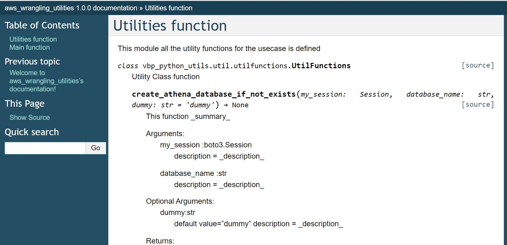

# Sphinx Documentation

## Setting up the sphinx

Create sphinx_docs folder to keep all those
Run the below comment and setup the sphinx
*sphinx-quickstart*

Which would create two folders build and source
And also conf.py , index.rst and MakeFile

## [conf.py](./source/conf.py)

In conf.py we define

1. Location of the python modules
2. Document details level.
3. html theme and custom formatter.

## [index.rst](./source/index.rst)

Here we define what are all the modules needed to be added in the documentation.
We have define the modules seperately here as [modules.rst](./source/modules.rst)

## [MakeFile](Makefile)

You can run *make help* to get more details.

*make html* -> create the html files in build folder and open the index.html
*make clean* -> clean the build folder.

